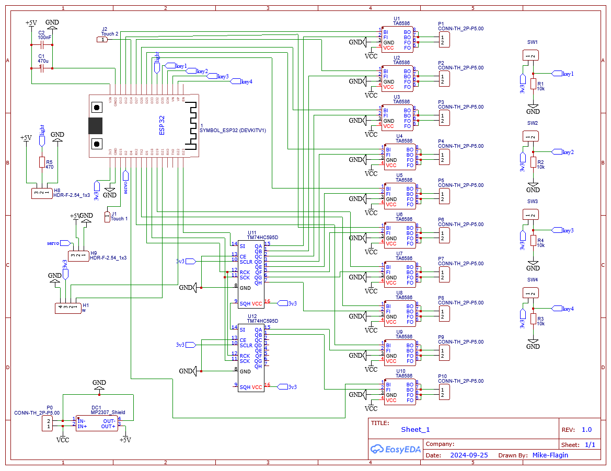
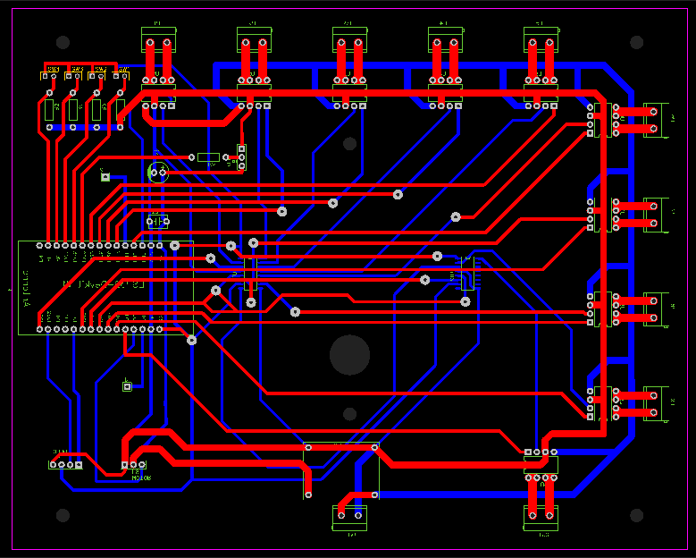
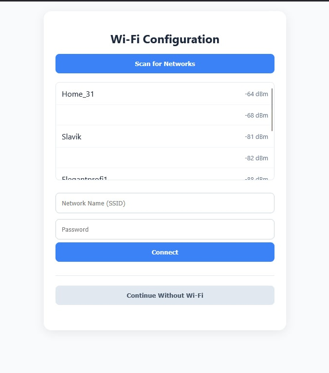
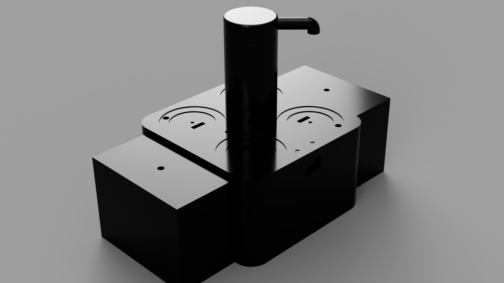

# ESP32 Automated Bartender Robot

An automated beverage mixing system built on the ESP32 microcontroller using the ESP-IDF framework and FreeRTOS. This project covers the full development cycle: from custom PCB design and hardware assembly to low-level firmware development and a Web UI for control.

## 🚀 Key Features
- Real-time Task Management: Powered by FreeRTOS for stable multi-tasking.
- Custom Hardware: Proprietary PCB designed specifically for this application.
- Interactive Display: 0.96" OLED display for status and menu navigation via I2C.
- Scalable Motor Control: Pump/Motor management using shift registers via SPI to save GPIO pins.
- Wireless Control: Integrated Web Server for remote drink selection and configuration over Wi-Fi.

---

## 🛠 Hardware & Design

### 📐 Schematic & PCB
The project features a custom-designed printed circuit board. It handles power distribution for the ESP32 and motor drivers.

> 

> 

### 📟 Peripherals
- Microcontroller: ESP32 (WROOM-32).
- Display: SSD1306 OLED (I2C).
- IO Expansion: 74HC595 Shift Registers (SPI) for driving pumps.
- Connectivity: Wi-Fi (Station/AP mode) for the Web Interface.

---

## 💻 Software Architecture

The firmware is written in C using the ESP-IDF framework.

### Key Components:
- FreeRTOS Tasks: Separate tasks for the Web Server, Display update logic, and Motor PWM control.
- I2C Driver: Custom implementation for OLED interaction.
- SPI Driver: Optimized data transmission for shift registers.
- NVS (Non-Volatile Storage): Used to save drink recipes and Wi-Fi credentials.

### Web Interface
The ESP32 hosts a lightweight HTTP server. Users can connect to the robot's IP address and select drinks via a responsive web dashboard.

> 

---

## 📸 Project Gallery
> 

---

## 👥 Authors

* Mykhailo Antipov — *Hardware Design, Firmware (ESP32, FreeRTOS), System Integration*
  [GitHub](https://github.com/Mike-Flagin)

* Anastasiia Shliienko — *Frontend Development (Web UI)*
  [GitHub](https://github.com/anastasiiashliienko)